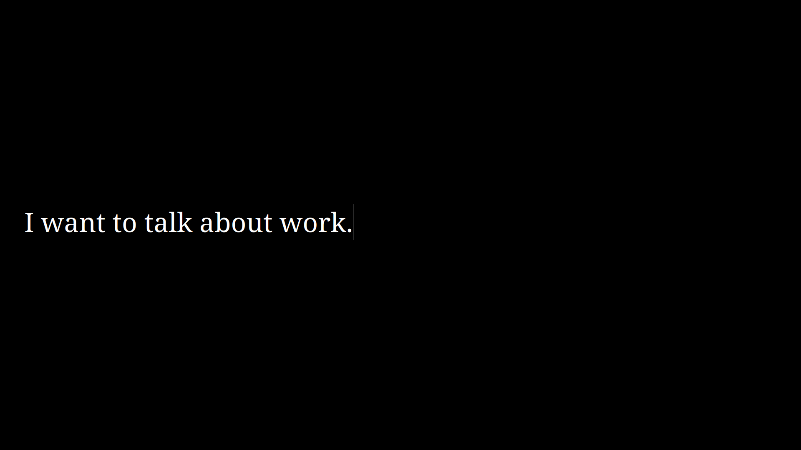

This application is inspired by the movie Top Gun: Maverick. This came about
after watching the scene when Iceman and Maverick are having a conversation. In
this scene, Iceman is communicating with maverick through a computer. The
application has no menu bar or status bar. It uses the whole display with black
background with the words in white. 

When watching the scene, I immediately wonder if I can create the same
application (almost). So I paused watching, then fire up Lazarus and start to
create the application.

As mentioned above, the application is written in Pascal using the Lazarus IDE.
You can see from the sourcecode that it uses only a single component. And the
code is basically 4-lines (what I typed at least.. :) :) :) ).

Application Notes:

* The application starts in Fullscreen mode.
* To close the application, press the "Esc" key.
* Pressing the "Enter" key will start another message (just like in the
  movie???).

Screenshot

